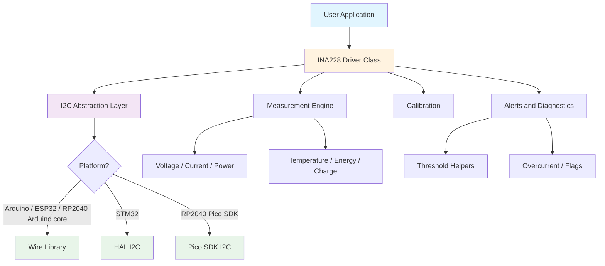

# INA228 Multiplatform Library

[](LICENSE.txt)
[](https://github.com/theohg/ina228_multiplatform/releases)
[](https://github.com/theohg/ina228_multiplatform/actions)


A C++ library for the **[TI INA228](https://www.ti.com/product/INA228)** current, voltage, power, energy, and charge monitor from Texas Instruments via I2C. It supports Arduino, ESP32, STM32, and RP2040 targets and uses a per-instance bus handle so multiple buses or devices can be used without global transport state.

## Features

- **Multi-platform**: Single codebase for Arduino/ESP32 (Wire), STM32 (HAL), and RP2040
- **Bus-first design**: The active I2C bus is passed directly into the constructor
- **Measurement coverage**: Bus voltage, shunt voltage, current, power, temperature, energy, and charge
- **Calibration helpers**: Constructor-driven calibration inputs plus direct calibration APIs
- **Alert support**: Diagnostic flags, threshold helpers, and high-level overcurrent configuration
- **Debug visibility**: Device identity, revision, and last-error accessors

## Architecture



## Repository Layout

```text
include/
  ina228.h
  ina228_platform_config.h
  ina228_platform_i2c.h
src/
  ina228.cpp
  ina228_platform_i2c.cpp
examples/
  basic_monitoring/
  alert_monitoring/
.github/workflows/
  ci.yml
  release.yml
```

## Installation

### PlatformIO

Add to your `platformio.ini`:

```ini
lib_deps =
    https://github.com/theohg/ina228_multiplatform.git#v1.0.0
```

### Arduino IDE

Download the repository or a release zip, then add it through Sketch -> Include Library -> Add .ZIP Library.

### STM32 HAL / Pico SDK

Copy `include/` and `src/` into your project, make sure the correct HAL or Pico SDK headers are available to the compiler, and keep I2C initialization in your application code.

## Usage Pattern

1. Initialize the I2C peripheral yourself.
2. Pass the active bus handle as constructor argument 1: `&Wire`, `&hi2c1`, `i2c0`, or `i2c1`.
3. Pass the 7-bit device address as constructor argument 2.
4. Call `init()` before taking measurements.

For Arduino-based Pico builds, use `&Wire`. For pure Pico SDK builds, use `i2c0` or `i2c1` directly.

## Quick Start

### Arduino / ESP32 / RP2040 Arduino core

```cpp
#include <Wire.h>
#include <ina228.h>

INA228 monitor(&Wire, 0x40, 0.008f, 10.0f);

void setup() {
    Serial.begin(115200);
    Wire.begin();

    if (!monitor.init()) {
        Serial.println("INA228 init failed");
        return;
    }

    monitor.setMode(INA228_MODE_CONT_TEMP_BUS_SHUNT);
}

void loop() {
    Serial.print("Bus: ");
    Serial.println(monitor.getBusVoltage(), 4);

    Serial.print("Current: ");
    Serial.println(monitor.getCurrent(), 3);
    delay(1000);
}
```

### STM32 HAL / Pico SDK

```cpp
#include "ina228.h"

INA228 monitor(&hi2c1, 0x40, 0.008f, 10.0f);
// For a pure Pico SDK project, pass i2c0 or i2c1 instead of &hi2c1.

void app_init() {
    monitor.init();
}
```

## Functional Overview

### Measurement Groups

| Group | Description |
|-------|-------------|
| Bus and shunt voltage | Read bus voltage and signed shunt voltage with unit-scale helpers |
| Current and power | Read instantaneous current and power in multiple unit scales |
| Temperature | Read die temperature for monitoring and compensation workflows |
| Energy and charge | Read accumulated energy and charge values in continuous mode |
| Alerts and thresholds | Configure diagnostic flags, overcurrent behavior, and voltage/current limits |

> **Note**: `init()` programs the calibration register from the constructor's shunt-resistor and max-current values.

## API Overview

### Measurements

| Method | Description |
|--------|-------------|
| `getBusVoltage()` / `getBusMilliVolt()` | Read bus voltage |
| `getShuntVoltage()` / `getShuntMilliVolt()` | Read signed shunt voltage |
| `getCurrent()` / `getMilliAmpere()` | Read calculated current |
| `getPower()` / `getMilliWatt()` | Read calculated power |
| `getTemperature()` | Read die temperature |
| `getEnergy()` / `getWattHour()` | Read accumulated energy |
| `getCharge()` / `getMilliAmpHour()` | Read accumulated charge |

### Configuration and Calibration

| Method | Description |
|--------|-------------|
| `init()` | Probe the device and apply calibration from constructor values |
| `setMode(...)` | Set the ADC operating mode |
| `setAverage(...)` | Configure averaging count |
| `setBusVoltageConversionTime(...)` | Configure bus-voltage conversion timing |
| `setShuntVoltageConversionTime(...)` | Configure shunt-voltage conversion timing |
| `setTemperatureConversionTime(...)` | Configure temperature conversion timing |
| `setMaxCurrentShunt(...)` | Apply a new shunt/current calibration |
| `setShuntTemperatureCoefficent(...)` | Configure shunt temperature coefficient compensation |

### Alerts and Diagnostics

| Method | Description |
|--------|-------------|
| `setOvercurrentLimit(...)` | Configure high-level overcurrent protection |
| `setDiagnoseAlert(...)` | Write diagnostic alert flags directly |
| `setShuntOvervoltageLimit_mV(...)` | Set shunt overvoltage limit in millivolts |
| `setBusOvervoltageLimit_mV(...)` | Set bus overvoltage limit in millivolts |
| `hasMathOverflow()` / `hasEnergyOverflow()` | Read overflow-related status helpers |
| `getManufacturer()` / `getDieID()` / `getRevision()` | Read device identity registers |
| `getLastError()` | Read the most recent low-level I2C error |

## Examples

- `examples/basic_monitoring/basic_monitoring.ino`
- `examples/alert_monitoring/alert_monitoring.ino`

## Notes

- Device addresses are always 7-bit.
- `init()` calibrates the device from the constructor's shunt resistor and max current inputs.
- `getLastError()` reports the most recent low-level I2C error for the instance.
- This multiplatform adaptation builds on earlier INA228 and INA226 library work by Rob Tillaart: [INA228](https://github.com/RobTillaart/INA228), [INA226](https://github.com/RobTillaart/INA226).
- PlatformIO CI compiles the examples on Arduino Nano, ESP32, STM32, and RP2040.

## You Like This Library? See Also

- [DRV8214 Multiplatform](https://github.com/theohg/drv8214_multiplatform)
- [BQ25756E Multiplatform](https://github.com/theohg/bq25756e_multiplatform)

## License

MIT License. See [LICENSE.txt](LICENSE.txt) for details.

Copyright (c) 2026 Theo Heng
